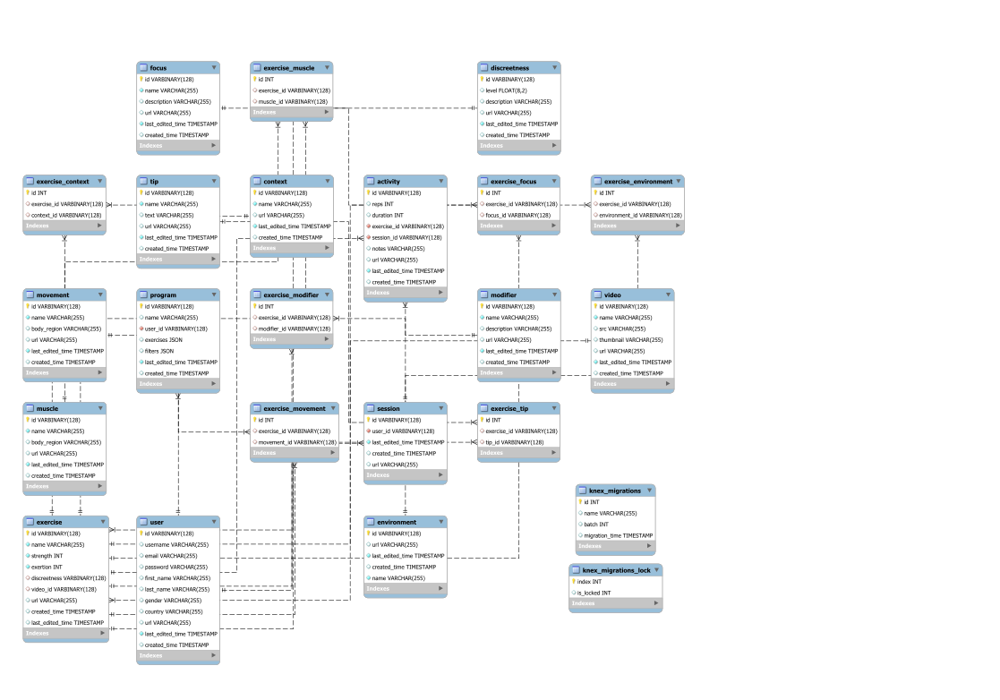

# Project Title

## Overview

The Movement Snack App is the Duolingo of strength training: You can get stronger in just 30 seconds a day, even if you are at work or wearing heels.

The gamification and structure of the Movement Snack App make it so easy so that even the most time-crunched professionals can keep their bodies strong.

### Problem

As people get older, they experience the effects of age and desk work on their bodies. People accept that this is a normal part of aging, which becomes a self-fulfilling prophecy. However, a true fountain of youth exists: exercise.

Everyone knows about the importance of exercise for health, yet very few people exercise at all, let alone strength train, which provides the best return on investment of all forms of exercise. Common reasons that prevent people from strength training include:
* Lack of time and motivation
* Misconceptions that you have to block off time for full workout and/or get sweaty in order for the exercise to "count".
* Not knowing where to start

Exercise, including muscle strengthening exercise, is not simply something to do for vanity, but essential for you to do what you want without feeling the effects of age and sedentary lifestyles. Not only does it get you stronger, but it can improve your coordination, flexibility, and cardiovascular health when done properly.

### User Profile

The Movement Snack App is targeted to people in the workforce who struggle to strength train consistently due to lack of time or motivation. The selection of exercises was curated to allow people to fit in exercise during their daily routine, whether it be at the workplace or while watching shows. There is no need to change into workout gear or block off extra time.

### Features

* Dashboard: This shows upcoming exercises and a button to start exercising. It also has an abbreviated version of their data visualization.
* Data visualization page: The user can see their exercise stats and activities at-a-glance. 
* Exercise log: Data-driven users can track their exercise over time.
* The user can filter exercises based on:
  * Level of discreetness: When the user is at work or in a Zoom meeting, they exercise discreetly if they choose.
  * Environment: The user can indicate whether they have access to things such as a couch, wall, desk, stairs, etc. that can be used for certain exercises.
  * Context: The user can filter for exercises that can be done while:
      * Watching TV
      * In limited space
      * While wearing high heels
      * While wearing boots
* Default exercise program: The user will be presented with an exercise so they don't have to decide what to do.
* Repeated exposure: The user gets to practice the same exercise over several weeks so they can make progress with it.
* Balanced movement diet: The user's movement repertoire includes all major movement categories: squat, hip hinge, lunge, push, pull, and core.
* Systematic and structured: Instead of doing random Youtube workouts, the user follows a program based on the expertise of a kinesiologist/exercise physiologist with 10 years of experiencing helping people move better and rehabilitate from injury.
* Current exercise streak: After logging each exercise, they will be shown their current streak. This is a gamification element to encourage users to be consistent.

## Implementation

### Tech Stack

Item | Function
--- | ---
Notion and Notion API | GUI content management software. Exercise data are added to the Notion app. Data are migrated from the Notion API to the server.
Knex | Data migration to MySQL
MySQL | Structured database
Next.js and React | Server and Front end
Plotly | Data visualization
Figma | Mockups

### APIs

Item | Function
--- | ---
Notion | The content of the exercise library is managed in Notion because of it is a no-code relational database with a nice UI. Notion has a SKD to allow for programmatic data extraction. A pipeline has been created to easily update the SQL database from Notion.

### Sitemap

#### Dashboard

Page | Description | Notes
--- | --- | ---
Dashboard | Shows upcoming exercises and an abbreviated version of their data visualization. Each exercise has a icon indicating the level of discreetness of the exercise, ranging from 1 ("invisible") to 5 ("full-on workout mode"). | Hovering over the number icon shows a tooltip describing the discreetness level.
Training page | View and log details for the current exercise. | The form fields are optional for logging activity to minimize friction with exercising. Once the "Done" button is clicked, a confirmation modal shows their new streak.
Stats page

### Data
Below is the entity relationship diagram of the database:

The tables in the database are grouped into:
1. Content data, i.e. related to exercises.
2. User and activity data.

There are many-to-many relationships between some tables.

Table | Group | What each record represents | Relations
--- | ---- | --- | ---
exercise | 1 | Properties of a single exercise. | several
movement | 1 | A movement category into which exercises are classified, e.g. squat, push. | Relates to `exercise` via `exercise_movement`
context | 1 | A non-gym context in which a user can perform the exercise, e.g. while wearing high heels, watching TV | Relates to `exercise` via `exercise_context`
discreetness | 1 | The level of discreetness of a given exercise, ranging from invisible to full workout-mode. | `exercise.discreetness` -> `id`
environment | 1 | The equipment or environment required for a given exercise, e.g. couch, wall | Relates to `exercise` via `exercise_environment`
focus | 1 | The focus of the exercise, e.g. strength, posture. | Relates to `exercise` table via the `exercise_focus` table.
modifier | 1 | A single way in which exercise execution can be modified, e.g. slow eccentric, add pause | Relates to `exercise` via `exercise_modifier`
muscle | 1 | A muscle group that may be trained by an exercise, e.g. glutes. | Relates to `exercise` via `exercise_muscle`
tip | 1 | An exercise tip | Relates to `exercise` via `exercise_tip`
video | 1 | A src for an exercise video |  `exercise.video_id` -> `id`
user | 2 | A user | 
session | 2 | The exercise sessions for a given user. | Foreign key: `user` -> `user.id`
activity | 2 | Data for a single set of a single exercise logged by a given user | Foreign keys: `exercise_id` -> `exercise.id`; `session_id` -> `session.id`

### Endpoints

Route | Method | Description | Status
--- | ---- | --- | ---
`/exercises:id` | GET | Get the details for a specific exercise. | done
`/users/sessions` | GET | Get a list of all a user's exercise sessions. | 
`/sessions` | POST | Create a new exercise session | done
`/users/:userId/sessions` | GET| Read a user's exercise sessions. | 
`/users/:userId/activities` | GET, POST, PUT | Read, log, and update a user's activity. |
`/activities` | POST, PUT | Log, and update a user's activity. |
`/programs` | GET | Generate a new program | done
`/programs/:userId` | POST | Write a new program for a user | done
`/programs/:userId` | GET | Get the most recent existing program for a user | done

Tables | CRUD operation | Description | Status
--- | ---- | --- | ---
`movement` | read | Get all movement categories. | done
`movements`, `exercises` | read | Get all exercises for a given movement category. The request body will include values for applying filters. | partially done; need filters

### Auth

The user will login with their username and password. 

## Roadmap

* Swap exercises: The user will be able to swap to a different exercise if they don't prefer the one that is presented.
* My exercises: The user can see the list of exercises they have previously done and choose from that list.

Page | Description
--- | ---
Set up page | Presented upon sign up. Includes a questionnaire.
My exercises | Shows the history of exercises completed by that user along with summary statistics
Exercise log | Shows the user’s training history in reverse chronological order. Includes all details for each activity. Includes filters for each exercise and movement category. 

## Nice-to-haves

* Sign up: The user will complete a brief questionnaire to sign up for an account.
* Secure authentication
* Ability for the user to upload their own exercise
* Social features: View the activity of friends.
* Leaderboard: Shows the top performers for select metrics across all users.
